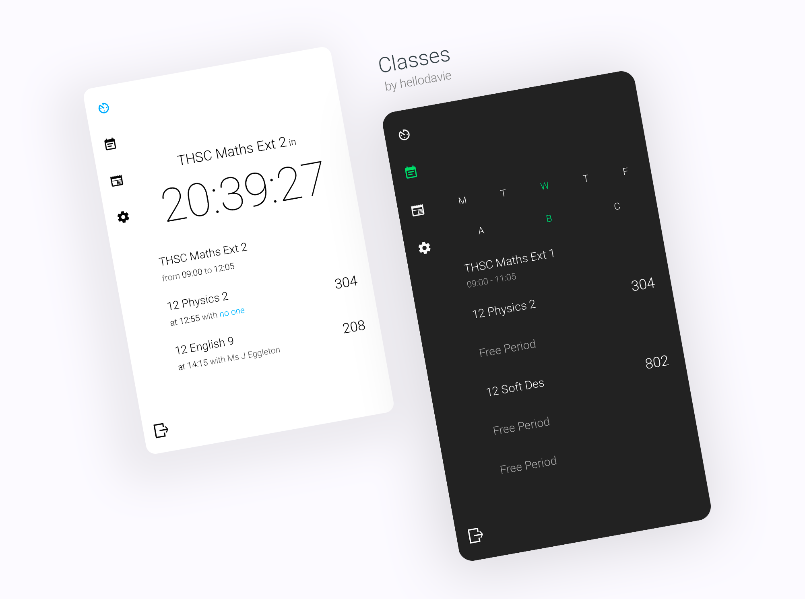

# Classes
[](https://travis-ci.com/hellodavie/shs_classes)


[](https://shsclasses.hellodavie.com/)


A blazing fast, modern, tested, and trusted timetable app for Sydney Boys High School. 
Previously known as [lordhelix.tk](https://shsclasses.hellodavie.com/).

<div align="center">
<br>
<a href="https://shsclasses.hellodavie.com/">
	
</a>
<br>
<br>
</div>

## At a glance
 - Offline support
 - Hide or show lunch breaks
 - Dark theme with customizable accent colours
 - Shows tomorrow's classes when you have free periods for the rest of the day
 - Exams are given priority when they overlap with your normal scheduled classes
 - Cross platform, automatic updates

## Functionality
A customizable dashboard for your classes;
Classes provides detailed information in a convenient manner to help students go about their day.
Displays teachers, casuals/subtitute teachers, shared classes, room variations, and assessments in the daily overview.
Also includes your full timetable, upcoming exams, daily notices, and settings for personalisation and flexibility.
No internet? No worries! Built as a progressive web app, offline support is automatically enabled by caching your timetable.
Change your primary colour, notices filter, or enable dark mode using the settings page.

## Building
To build a production release of the frontend, use the following command
```sh
$ npm build
```

## Deployment
Configuration of the backend is done through the following environment variables
```
DATABASE_URL=
COOKIE_SECRET=
CLIENT_ID=
CLIENT_SECRET=
REDIRECT_URI=
```

Set up Postgres with the [connect-pg-simple schema](https://github.com/voxpelli/node-connect-pg-simple/blob/fc163b26511d746452ef42c798ab766caca2a5ac/table.sql) to enable user sessions.
Notices and patch notes schemas are set up with `knex.js` migrations. Use `npx knex migrate` to create the tables.
Finally, use `npm start` to fire up the backend.

## License
Based on the original lordhelix app (MIT License), &copy; 2016 Ram Kaniyur. All Rights Reserved.
Maintained by Eddie Qi over the period of 2017-18.

New classes app and modifications are under the MIT License. &copy; 2020 David Wu. All Rights Reserved. \
See LICENSE for further information and licensing for images in this readme.
